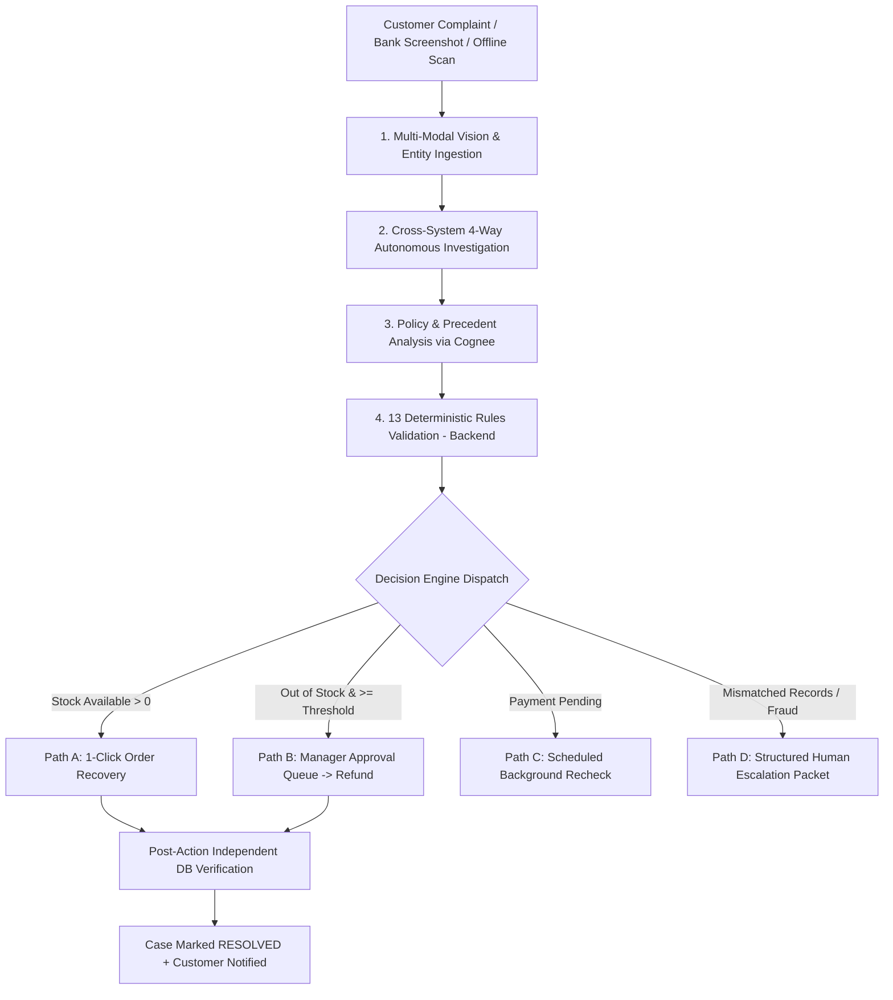

# RESOLVE AI - Payment Issue Resolution & Technical Interview Guide

> **Project Reference**: `Resolve-AI-1`  
> **Core Architectural Principle**: *"AI Proposes. Code Decides."*  
> **Target Roles**: Full-Stack Developer, AI / LLM Engineer, Backend Engineer, Solutions Architect, Technical Product Manager.

---

## 1. Executive Summary & The Problem

### The Core Problem in Modern E-Commerce / Fintech
In digital commerce, checkout and payment mismatches cause massive customer dissatisfaction and operational costs:
1. **Webhook Drops & 504 Gateway Timeouts**: The customer is debited by their bank, but the merchant order management system (OMS/ERP) never receives the confirmation webhook due to network blips or timeouts. The customer loses money with no order confirmation.
2. **Stock Race Conditions**: A user's payment completes successfully, but inventory reaches 0 before the order record is written.
3. **Delayed Banking Callbacks (3DS / Pending)**: Transactions remain in a `PENDING` state for hours, leaving customers in limbo.
4. **Duplicate Retries & Double Refunds**: Uncoordinated retries by customer service or webhooks create duplicate orders or double refunds.

### How RESOLVE AI Solves It
**RESOLVE AI** acts as an **autonomous, accountable AI customer-service teammate**. It takes complete ownership of payment-order mismatch cases from initial customer complaint or background detection until an independently verified resolution:
- **Autonomous Multi-System Investigation**: Cross-examines the banking gateway, merchant checkout session, warehouse inventory, and refund records.
- **Strict Deterministic Guardrails**: 13 code-level rules prevent hallucinations, duplicate orders, and unauthorized payouts.
- **Human-in-the-Loop (HITL)**: High-value actions (e.g. refunds $\ge$ ₹500) generate approval tasks for store managers.
- **Proactive Background Reconciliation**: Finds orphan debits and resolves them even if the customer never files a complaint.

---

## 2. System Architecture & The 5-Stage Investigation Pipeline



### The 4 Connected Systems Investigated
1. **Simulated Banking Gateway / Ledger**: Verifies real debit status (`SUCCESS`, `PENDING`, `FAILED`, `NOT_FOUND`), bank RRN, and auth codes.
2. **Checkout Attempt Store**: Validates customer ID, product ID, currency, and expected decimal amount.
3. **Merchant Warehouse / ERP**: Confirms whether an order was created and checks physical stock units.
4. **Refund Registry**: Ensures no refund is already in-flight or completed.

---

## 3. Technology Stack & Component Mapping

| Component | Technology | Role & Key Responsibility |
| :--- | :--- | :--- |
| **Backend API** | **FastAPI, Python 3.12** | High-performance async REST API; executes business logic, auth, and state machines. |
| **ORM & Database** | **SQLAlchemy 2.0 Async, MongoDB Atlas, SQLite/PostgreSQL** | Authoritative data store; manages ACID transactions, idempotency constraints, and real-time audit event streaming. |
| **Data Validation** | **Pydantic V2** | Strict schema validation, decimal amount parsing, and typed payload contracts. |
| **AI Orchestration** | **n8n Cloud (10 Modular Sub-Workflows)** | Visual orchestration of webhooks, routing, AI reasoning nodes, and worker telemetry streaming. |
| **Knowledge & Policy Layer** | **Cognee Cloud / Semantic Knowledge Store** | Stores merchant refund thresholds, order recovery policies, and historical resolution precedents. |
| **Vision & Reasoning AI** | **GPT-4o / Vision AI** | Parses bank receipt screenshots, extracts TXN reference/RRN/error codes, and structures natural language explanations. |
| **Frontend UI** | **React 18, Vite, Tailwind CSS, Lucide Icons** | Multi-persona portal (Customer, Support Agent, Store Manager, Demo Lab). |
| **Interactive Visualization** | **Three.js / HTML5 Canvas / Lucide** | Animated **3D/2D AI Worker Floor** showing real-time agent tasks (Payment Agent, Inventory Agent, Audit Agent, etc.). |
| **Security & RBAC** | **PyJWT, Passlib (Bcrypt)** | Tenancy isolation, JWT authentication, and customer/employee/merchant permissions. |

---

## 4. Architectural Core: *"AI Proposes. Code Decides."*

A foundational concept in Resolve AI is the **strict separation of cognitive intelligence from transaction execution authority**:

```
┌────────────────────────────────────────────────────────┐
│                   AI / REASONING LAYER                 │
│  (n8n Cloud, Cognee Knowledge, GPT-4o Vision AI)       │
│  - Understands natural language complaints             │
│  - Reads bank debit screenshots                        │
│  - Queries store policies from Cognee                  │
│  - PROPOSES candidate action (e.g. ORDER_RECOVERY)     │
└──────────────────────────┬─────────────────────────────┘
                           │ Candidate Proposal
                           ▼
┌────────────────────────────────────────────────────────┐
│             AUTHORITATIVE BACKEND ENGINE               │
│          (FastAPI, SQLAlchemy, MongoDB Atlas)          │
│  - Authenticates user (JWT / RBAC)                     │
│  - Validates tenancy isolation (Customer ownership)    │
│  - Checks 13 Deterministic Business Rules in code      │
│  - Enforces Idempotency Keys (No double execution)     │
│  - Executes mutations & verifies DB state              │
└────────────────────────────────────────────────────────┘
```

### The 13 Deterministic Business Rules Matrix

| Rule # | Name | Authoritative Code Enforcement |
| :--- | :--- | :--- |
| **Rule 1** | Customer Ownership | Customer can only query their own account ID and payment data. |
| **Rule 2–5** | Strict Matching | Reference, Merchant, Decimal Amount, and Currency must match exactly. |
| **Rule 6** | No Duplicate Order | Idempotency key `RECOVERY-{case_id}-{payment_id}` + Unique DB constraint. |
| **Rule 7** | No Duplicate Refund | Unique refund constraint per payment reference. |
| **Rule 8** | Mutually Exclusive | Recovery and refund cannot execute concurrently on the same payment. |
| **Rule 9** | Screenshot Proof Insufficient | Must be verified against live banking gateway API. |
| **Rule 10** | Uncertain Refund Guard | Query existing provider reference before retrying any payout. |
| **Rule 11** | Stored Action Telemetry | Every action logs `requested_by`, `approved_by`, and execution metadata. |
| **Rule 12** | Request != Resolution | Request status remains pending until independent confirmation. |
| **Rule 13** | Independent Verification | Case only marks `RESOLVED` after post-action database verification. |

---

## 5. Comprehensive Interview Q&A Guide

### Q1: How does your system guarantee that a customer is never double-refunded or given duplicate orders?
**Answer:**
> "We implement idempotency at both the API and database levels. Every modifying action requires an **Idempotency Key** derived from the case and action type, for example `RECOVERY-{case_id}-{payment_id}`.
> In our database schema, `payment_id` has a strict unique constraint with orders and refunds. Under our deterministic business rules (Rule 6 and Rule 7), if a duplicate webhook arrives or a customer retries a request, the backend detects the existing key, bypasses re-execution, and returns the existing transaction result with status `ALREADY_PROCESSED`."

---

### Q2: Why did you separate AI reasoning from backend business logic ('AI Proposes, Code Decides')?
**Answer:**
> "LLMs are probabilistic and non-deterministic, making them unsuitable for direct financial mutations. Allowing an LLM direct database access or execution authority introduces risks of hallucinated refunds, race conditions, or unauthorized account access.
> In Resolve AI, the AI's role is restricted to parsing natural language, extracting text from images, and proposing an action based on context. Our FastAPI backend remains strictly authoritative, validating 13 deterministic rules (JWT auth, decimal precision, stock availability, idempotency) before executing any state change."

---

### Q3: What is Cognee's role and why is it used instead of querying MongoDB directly?
**Answer:**
> "MongoDB Atlas is our **transactional database** storing live state: payments, orders, accounts, and audit events.
> **Cognee** is our **semantic memory and policy layer**. It indexes unstructured operational knowledge—such as merchant refund policies, manager approval threshold rules (e.g., 'refunds $\ge$ ₹500 require store manager sign-off'), and historical resolution precedents. During an investigation, the AI queries Cognee for the relevant merchant policy without needing complex ad-hoc database queries."

---

### Q4: How does your system implement Human-in-the-Loop (HITL) for high-value transactions?
**Answer:**
> "Store managers configure threshold policies (e.g. ₹500.00). When an item is out of stock and requires a refund:
> 1. If the amount is below the threshold, the refund is auto-approved.
> 2. If the amount meets or exceeds the threshold, the system transitions the case to `WAITING_FOR_APPROVAL` and creates a pending approval record.
> 3. The manager inspects the case telemetry in their dashboard. Upon clicking 'Approve' or 'Reject', the state machine advances to execute the refund or escalate the case."

---

### Q5: How do you handle pending payments and asynchronous banking callbacks?
**Answer:**
> "If the banking gateway returns `PENDING`, Rule 12 prohibits creating a phantom order or issuing an unverified refund. The state machine transitions the case to `WAITING_FOR_PROVIDER` and schedules a background recheck.
> Our asynchronous `BackgroundWorker` polls the gateway on an interval. Once the bank callback confirms `SUCCESS`, the worker resumes the investigation pipeline automatically."

---

### Q6: What is Proactive Background Reconciliation, and how does it work when the user is offline?
**Answer:**
> "Many customers close their browser immediately upon an error and never file a ticket. Our `BackgroundWorker` periodically scans for **orphan payments** (payments confirmed as `SUCCESS` at the gateway with no linked `Order` and no active `Case`).
> When detected, the worker automatically initializes a case, runs the 4-way cross-system check, and dispatches an in-app notification to the customer explaining that their transaction is being resolved proactively."

---

### Q7: What happens if a customer uploads a manipulated or fake bank screenshot?
**Answer:**
> "Our Vision AI agent parses the image to extract the claimed transaction reference and amount. However, under **Rule 9 ('Screenshot Proof Insufficient')**, screenshot data is strictly an investigation clue, not authoritative proof.
> The backend verifies the reference against the simulated banking gateway. If the gateway returns `NOT_FOUND` or shows an amount mismatch, automated resolution is halted and the case is escalated to a human specialist with telemetry flags."

---

### Q8: What role does n8n play versus the FastAPI backend?
**Answer:**
> "n8n acts as the visual workflow orchestration engine. It coordinates the 10 modular sub-workflows (such as payment check, order recovery, refund monitor, and settlement monitor), handles external webhooks, and emits telemetry events to the frontend worker floor.
> If n8n Cloud is unreachable, our backend features a built-in native Python fallback engine that seamlessly runs the investigation locally, ensuring high availability."

---

### Q9: How do you ensure multi-tenant security and customer data isolation?
**Answer:**
> "We enforce Role-Based Access Control (RBAC) through JWT tokens combined with customer tenancy isolation (Rule 1). When any request enters the `/cases` or `/orders` endpoints, FastAPI's dependency injection compares the authenticated user's ID with the resource owner. Any customer attempting to query or recover another user's transaction is blocked with an HTTP 403 Forbidden error."

---

### Q10: How does the system handle gateway timeouts (504 Gateway Timeout) without data inconsistency?
**Answer:**
> "We utilize explicit state transitions (`ACTION_IN_PROGRESS` $\rightarrow$ `VERIFYING` $\rightarrow$ `RESOLVED` / `FAILED`). If a timeout occurs, the case moves to `WAITING_FOR_PROVIDER` rather than assuming failure or immediately retrying.
> The background monitor checks the provider using the existing provider reference before attempting any secondary action, preventing double debits or duplicate orders."

---

## 6. The 10 Testable Demo Scenarios

| Scenario ID | Name & Description | Badge / State |
| :--- | :--- | :--- |
| `SCENARIO_1_RECOVERY` | **Main Demo**: Payment SUCCESS, Order MISSING, Stock AVAILABLE. AI offers recovery, user confirms, order recovered. | `Happy Path` |
| `SCENARIO_2_REFUND` | **Out-of-Stock Refund**: Payment SUCCESS, Stock 0, Amount $\ge$ ₹500. Manager approval required, approved, refund issued. | `Approval Required` |
| `SCENARIO_3_PENDING` | **Pending Payment**: Payment pending at bank. AI schedules background recheck without creating order or refund. | `Pending State` |
| `SCENARIO_4_DUPLICATE` | **Duplicate Webhook**: Webhook arrives twice. Idempotency prevents duplicate order creation. | `Idempotency Guard` |
| `SCENARIO_5_REFUND_EXISTS`| **Refund Already Exists**: Payment was already refunded. AI tracks existing refund instead of double-refunding. | `Duplicate Refund Guard`|
| `SCENARIO_6_CONFLICT` | **Conflicting Records**: Inconsistent amount/currency. AI prepares structured human handoff packet. | `Human-in-the-Loop` |
| `SCENARIO_7_TIMEOUT` | **Provider Timeout**: External gateway timeout. System retries safely with existing provider ref. | `Resilience` |
| `SCENARIO_8_ORDER_EXISTS` | **Payment & Order Exist**: Safe lookup confirming active order without duplicating records. | `Safe Lookup` |
| `SCENARIO_9_NOT_FOUND` | **Payment Not Found**: Customer claims debit, but gateway has no record. AI escalates with logs. | `Escalation` |
| `SCENARIO_10_RECON` | **Autonomous Background Recon**: Customer is offline. Background worker detects unlinked payment, opens case & notifies. | `Proactive AI` |
