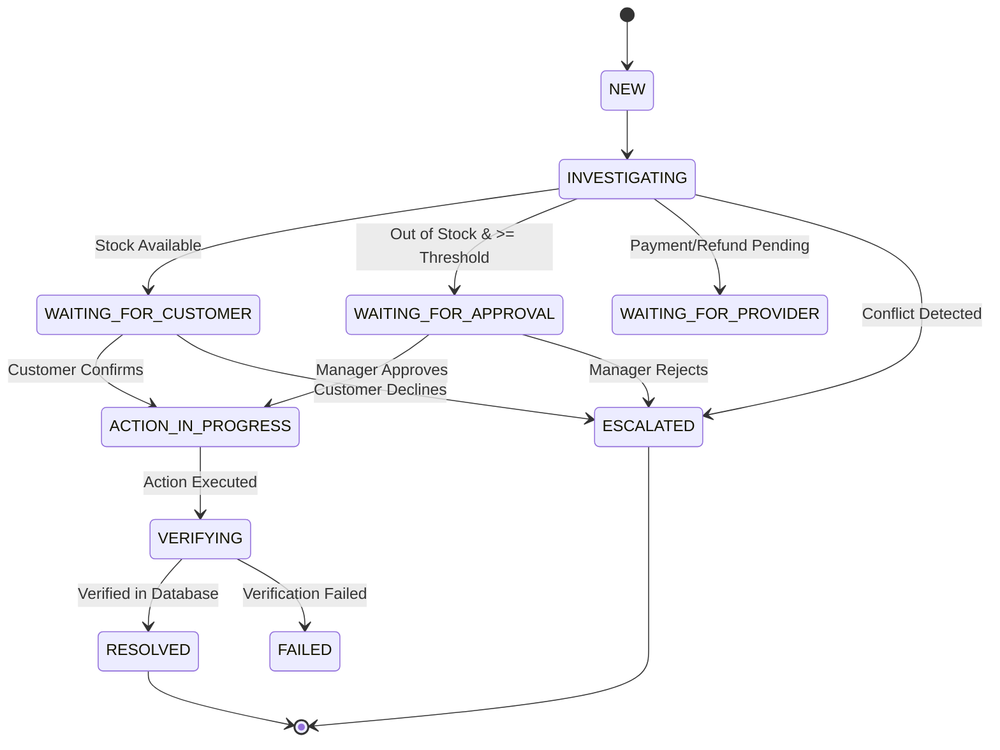

# RESOLVE AI — System Architecture

## Core Architectural Principle
> **AI PROPOSES. CODE DECIDES.**

RESOLVE AI operates on a strict separation of intelligence and authority:
1. **AI / Orchestration Layer (n8n & Cognee)** handles complaint comprehension, missing information detection, tool recommendation, policy synthesis, and customer-facing explanations.
2. **FastAPI Backend & PostgreSQL** remain strictly authoritative for authentication, RBAC, tenant isolation, amount/currency validation, idempotency guards, financial action execution, and independent verification.

---

## High-Level Topology

```
┌────────────────────────────────────────────────────────┐
│               RESOLVE AI USER INTERFACES               │
│  Customer Portal  │  Employee Queue  │ Merchant Console│
└───────────────────────────┬────────────────────────────┘
                            │ (JWT Auth & REST API)
┌───────────────────────────▼────────────────────────────┐
│                    FASTAPI BACKEND                     │
│  - RBAC & Customer Isolation   - Deterministic Rules   │
│  - Idempotency Guards          - Case State Machine    │
│  - Action Logging & Audit      - Background Reconciler │
└──────┬────────────────────┬────────────────────┬───────┘
       │                    │                    │
┌──────▼──────┐      ┌──────▼──────┐      ┌──────▼──────┐
│  SIMULATED  │      │  N8N CLOUD  │      │   COGNEE    │
│  PROVIDERS  │      │ ORCHESTRATOR│      │  KNOWLEDGE  │
│ - Payments  │      │- Multi-Step │      │ - Policies  │
│ - Checkouts │      │  Workflows  │      │ - Recovery  │
│ - Refunds   │      │- Propose Act│      │ - Precedents│
└──────┬──────┘      └─────────────┘      └─────────────┘
       │
┌──────▼─────────────────────────────────────────────────┐
│              POSTGRESQL DATA STORE                     │
│ Users, Merchants, Products, Payments, Checkouts,       │
│ Orders, Refunds, Cases, Case Events, Actions, Approvals│
└────────────────────────────────────────────────────────┘
```

---

## Deterministic Business Rules Matrix

| Rule # | Name | Authoritative Enforcement |
| :--- | :--- | :--- |
| **Rule 1** | Customer Ownership | Customer can only query their own account ID |
| **Rule 2-5** | Reference & Amount Match | Strict decimal matching on amount, currency, and merchant |
| **Rule 6** | No Duplicate Order | Idempotency key `RECOVERY-{case_id}-{payment_id}` + Unique DB constraint |
| **Rule 7** | No Duplicate Refund | Unique refund constraint per payment reference |
| **Rule 8** | Mutually Exclusive | Recovery and refund cannot execute concurrently on same payment |
| **Rule 9** | Screenshot Proof Insufficient | Must be verified with simulated gateway API |
| **Rule 10** | Uncertain Refund Guard | Query existing provider ref before retrying payout |
| **Rule 11** | Stored Action Telemetry | Every action logs requested_by, approved_by, and result payload |
| **Rule 12** | Request != Resolution | Request status is PENDING until confirmed |
| **Rule 13** | Independent Verification | Case only marks RESOLVED after post-action database verification |

---

## State Machine


